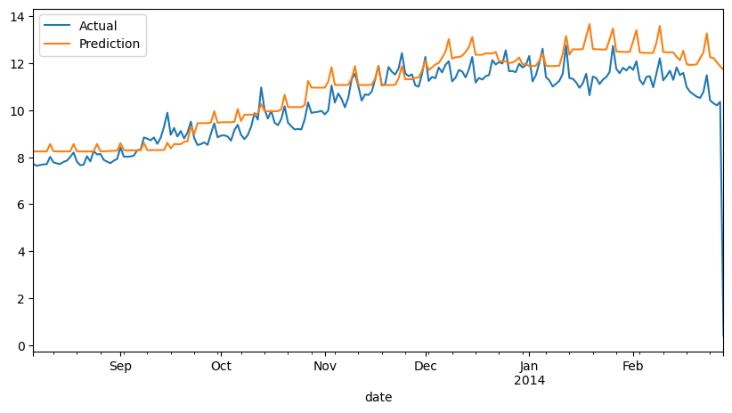

# London Energy Price Prediction

**Author**: HuyIGW04  
**Dataset**: London‐energy (2012–2014)  
**Problem**: Time‐series forecasting of electricity prices in London

---

## 1. Introduction
Today I’m working with the **London‐energy** dataset, which contains hourly electricity price data for the city of London from 2012 through 2014. My goal is to build a robust time‐series model to forecast future prices.

## 2. Data Preprocessing
1. **Time Indexing**  
   - Converted the timestamp column to `datetime64[ns]` in pandas.  
2. **Feature Engineering**  
   - Extracted calendar features (hour, day of week, month).  
   - Created rolling statistics (e.g., 24-hour moving average).  
3. **Train/Test Split**  
   - Used an 80/20 split with `TimeSeriesSplit` to ensure temporal integrity.

## 3. Modeling
- **Algorithm**: Gradient Boosting Regressor  
- **Cross‐Validation**: `TimeSeriesSplit` (5 splits)  
- **Hyperparameter Tuning**: `GridSearchCV` over learning_rate, n_estimators, max_depth

## 4. Evaluation Metrics
- **Mean Squared Error (MSE)**: ~ 1.287  
- **Mean Absolute Error (MAE)**: ~ 0.730  
- **Mean Absolute Percentage Error (MAPE)**: ~ 6.6%

## 5. Results

Below is a comparison of the model’s predictions versus the actual electricity prices on the test set:

## 6. Conclusion
The Gradient Boosting model demonstrates strong performance on this time‐series forecasting task, achieving low error rates comparable to established benchmarks in scikit-learn.

--**implemented by HuyIGW04""